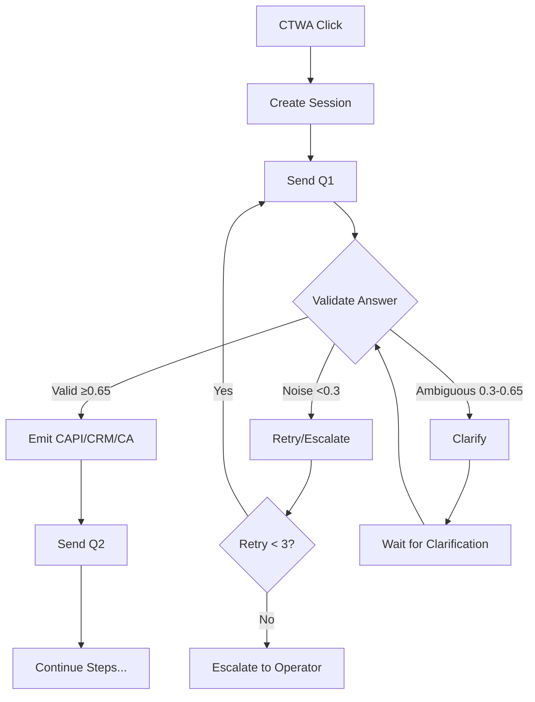
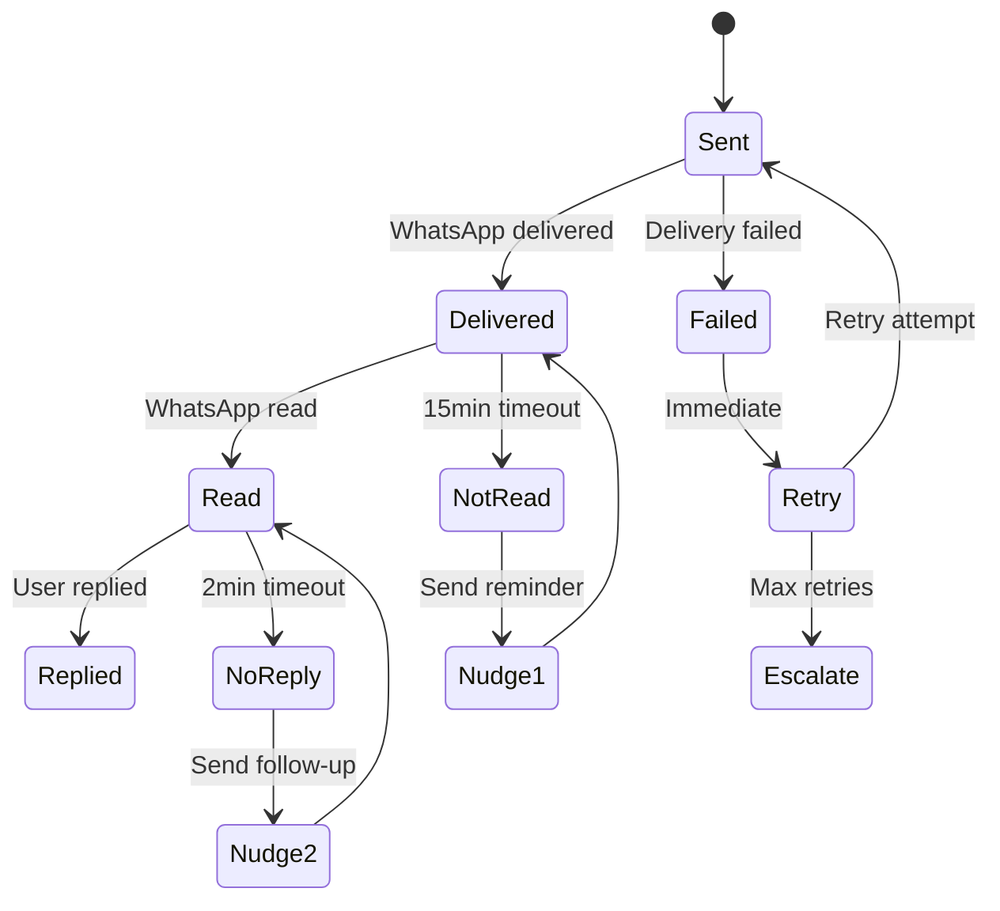

# 🚀 Arriwa - Техническая документация платформы

> **📎 Связанные документы:**
> - [Webhook Payload Specification](../incoming-webhooks/webhook-payload-specification.md) - RAW формат входящих webhook
> - [Subscriber Data Structure](../subscriber/exact-subscriber-data-structure-v2.md) - модель данных подписчика в БД
> - [WhatsApp Message Types](../wa-types-message.md) - полный список типов сообщений
> - [Project Description](../project-description/description.md) - концептуальный обзор ОБЩИЙ ПУТЬ

---

## ✅ АРХИТЕКТУРА И КОМПОНЕНТЫ СИСТЕМЫ

### 📱 Точки входа

**`CTWA`** (Click to WhatsApp Ads)  
Реклама Facebook/Instagram с переходом в WhatsApp

**`Direct Message`**  
Прямое сообщение без рекламного источника

**`QR Code`**  
Сканирование QR-кода с переходом в чат

**`Link Share`**  
Переход по wa.me ссылке

### 🎯 Этапы воронки

**`Qualification Steps`** (Q1...Qn)  
Пошаговая квалификация лида

**`Content Funnel`**  
Обучающий контент после квалификации

**`Product Showcase`**  
Демонстрация товаров/услуг

**`Payment Flow`**  
Процесс оплаты через Stripe

### 🤖 Классификация ответов

**`valid`**  
Валидный ответ на вопрос воронки (confidence ≥ 0.65)

**`noise`**  
Шум/бред/нерелевантный ответ (confidence < 0.3)

**`ambiguous`**  
Неоднозначный ответ требующий уточнения (0.3 ≤ confidence < 0.65)

### 🔄 Потоки данных

**`GOOD`**  
Основной поток валидных ответов

**`NOISE`**  
Поток невалидных/мусорных ответов

**`ESCALATION`**  
Эскалация на оператора

### 🛑 Код-слова управления

**`stop`** / **`стоп`** / **`unsubscribe`**  
Полная отписка от рассылок

**`pause`** / **`пауза`**  
Временная приостановка

**`start`** / **`старт`**  
Возобновление после паузы

**`operator`** / **`оператор`**  
Запрос живого оператора

### 📊 Интеграции

**`CAPI`** (Facebook Conversions API)  
События конверсий для оптимизации

**`Pixels`**  
для регистрации событий (GOOD и NOISE потоки на разные pixels/datasets)

**`Ads Manager`**  
для выгрузки статистики рекламных кампаний

**`Custom Audience`**  
для сохранения и расширения, LAL

**`E-commerce и WhatsApp catalog`**  
для отправки карточек товаров напрямую в чат WhatsApp

**`Ads Audience Transporter`**  
для экспорта аудиторий в Google, TikTok, LinkedIn

**`Enrichment`**  
для двухстороннего обогащения всех компонентов данными

**`Kommo CRM`**  
для управления статусами сделок

**`Stripe`**  
для проведения оплат

**`Vuexy`**  
frontend для работы с некоторыми модулями, отчетами и пр

---

## 🏢 Онбординг (из описания проекта)

Шаги (строго по описанию):
1. https://flows.rakhnianskii.com — первичная авторизация Facebook (public_profile, business_management, email)
2. /wa-onboarding — только этот раздел доступен
3. Прохождение онбординга (создание приложения, получение/привязка номера)
4. /credentials — разблокировка раздела для привязки CAPI, Pixels, аудитории, статистики (ads_read, ads_management)
5. Опционально авторизация для e-commerce каталога (commerce_account_read_orders, commerce_account_read_reports, commerce_account_read_settings, catalog_management)
6. Редирект на /chatflows

---

## 🔧 FLOWISE ОРКЕСТРАЦИЯ И ИСТОЧНИКИ ИСТИНЫ

### Agentflow → Chatflow архитектура

**Двухуровневая система:**
- **Agentflow** - управляющий слой, маршрутизация сообщений
- **Chatflow** - исполнительный слой, LLM обработка и валидация

**Формат sessionId (универсальный):**
```
{source}_{details}_{subscriber_id}_{timestamp}
```

Примеры:
- **CTWA**: `ctwa_fb_{subscriber_id}_{timestamp}`
- **QR**: `qr_{product_id}_{subscriber_id}_{timestamp}`  
- **Direct**: `direct_{subscriber_id}_{timestamp}`
- **Link**: `link_{utm_source}_{subscriber_id}_{timestamp}`

### Двухуровневая проверка код-слов

**Уровень 1: Бэкенд (primary source of truth)**
- Проверяется на КАЖДОМ входящем сообщении до любой другой логики
- Нормализация в lowercase, поиск синонимов
- Немедленное исполнение действий (optOut, snooze, escalation)

**Уровень 2: Flowise Agentflow (страховочная сетка)**
- Дублирующая проверка для edge cases
- Срабатывает при ручном запуске или сбое webhook
- Синхронизация с бэкендом через API

### Источники истины и согласованность

**Код-слова**: бэкенд (единственный источник истины)
- Flowise: страховочная проверка для edge cases (ручной запуск, сбой webhook)

**Состояние шага**: Flowise Variables + БД (для восстановления)
- Variables: живое состояние в рамках сессии
- БД: персистентное состояние для восстановления после рестарта

**История чата**: Redis/Valkey (живая) + Postgres (архив)

**Счетчики репромптов**: Flowise Variables (в рамках шага)

**Счетчики нуджей**: бэкенд nudge-service (между сообщениями)

**CTWA данные**: БД (неизменяемые после создания)

### Идемпотентность через event_id

```javascript
// Генерация уникального event_id
event_id = `{sessionId}-q{n}-{hash(answer_raw)}`

// Проверка в outbox перед эмиссией
const exists = await db.events_outbox.findUnique({
  where: { event_id }
})

if (exists) {
  return exists.result // Возвращаем предыдущий результат
}
```

---

## 📋 ТОЧКИ ВХОДА И ИНИЦИАЛИЗАЦИЯ

### CTWA-клик и первое сообщение

**Последовательность действий:**
1. Пользователь кликает на рекламу Facebook/Instagram
2. Открывается WhatsApp с предзаполненным номером бизнеса
3. Пользователь отправляет первое сообщение (любой текст или шаблонное приветствие)

**Webhook Gupshup принимает сообщение:**
- **Извлекаются CTWA-параметры**: campaign_id, adset_id, ad_id, creative_id, utm_*, placement, publisher_platform, click_id
- **Создается уникальный sessionId**: `ctwa_fb_{subscriber_id}_{timestamp}`
- **Стартовый триггер**: любое первое входящее сообщение
- **Нормализация данных**: phone, name, language, country, timezone

### QR Code вход (альтернативная точка)

**QR содержит**: `wa.me/79991234567?text=QR_START_PROMO&product_id=SKU001&location_id=MSK`

**Извлекаются параметры**: product_id, location_id, promo_code

**Создается сессия**: `qr_{product_id}_{subscriber_id}_{timestamp}`

**Приоритет**: показ конкретного товара/услуги из product_id

### Постоянный мониторинг код-слов

**Проверяется на КАЖДОМ входящем сообщении до любой другой логики:**

Слова / синонимы (нормализованные в lowercase):
- `stop | стоп | unsubscribe` → немедленная отписка (optOut=true)
- `pause | пауза | snooze` → установка `snoozed_until`
- `operator | оператор | human` → эскалация HITL
- `start | старт | resume` → сброс snooze, возобновление

### Атомарная инициализация (параллельно)

**CAPI Facebook**: событие Start/OptIn с хешированным номером телефона
**Custom Audiences**: добавление в аудиторию A1_STARTED_NOT_FINISHED
**Kommo CRM**: создается контакт и сделка в стадии "Новый"
**База данных**: записывается подписчик с CTWA-параметрами и raw referral блоком
**Менеджер**: назначается по правилам (round-robin/нагрузка/гео)
**Flowise**: запускается Agentflow с контекстом сессии

---

## 🎯 КВАЛИФИКАЦИОННАЯ ВОРОНКА

### Матрица решений по шагам

**Стандартные вопросы:**
- Q1: "Какая у вас основная боль/задача?"
- Q2: "Какой у вас месячный бюджет на маркетинг?"
- Q3: "Какой основной канал продаж сейчас?"
- Q4: "Готовы ли увеличить бюджет при росте продаж?"
- Q5: "Какой ключевой показатель (KPI) станет для вас мерилом успешного масштабирования бизнеса?"

### Логика валидации ответов

**При валидном ответе (confidence ≥ 0.65):**
- CAPI → событие QUALIFY_Q{n}
- Custom Audiences → добавление в CA_QUAL_Q{n} и сегментные (бюджет/канал/ниша)
- CRM → обновление custom fields в контакте (cf_niche, cf_budget_month)
- БД → сохранение ответа и confidence score
- Переход к следующему шагу

**При шуме/неопределенности (confidence < 0.65):**
- Репромпт → до 3 попыток уточнения в рамках шага
- NOISE pixel → отдельный dataset для исключений
- Custom Audiences → CA_EXCLUDE_NOISE
- CRM → тег trash/ambiguous
- При превышении лимита → эскалация на оператора

### StepValidator (Custom Function в Chatflow)

```javascript
async function validateStep(input, options) {
  const { step, answer, session } = input
  
  // Вызов LLM для классификации
  const validation = await classifyAnswer({
    step,
    question: QUESTIONS[step],
    answer,
    context: session.variables
  })
  
  // Определение validity
  let validity = 'ambiguous'
  if (validation.confidence >= 0.65) {
    validity = 'valid'
  } else if (validation.confidence < 0.3) {
    validity = 'noise'
  }
  
  // Сохранение в БД с идемпотентностью
  const eventId = generateEventId(session.id, step, answer)
  await db.funnel_answers.upsert({
    where: { event_id: eventId },
    create: {
      session_id: session.id,
      step,
      answer_raw: answer,
      answer_parsed: validation.parsed,
      validity,
      confidence: validation.confidence,
      event_id: eventId
    }
  })
  
  // Эмиссия событий для valid
  if (validity === 'valid') {
    await emitToAllChannels({
      event_type: `QUALIFY_${step}`,
      event_id: eventId,
      session,
      answer: validation.parsed
    })
  }
  
  return {
    validity,
    confidence: validation.confidence,
    parsed: validation.parsed,
    nextAction: determineNextAction(validity, session)
  }
}
```

---

## ⏱ НУДЖИ И НАПОМИНАНИЯ - STATE MACHINE

### Автоматические триггеры

**Не прочитано 15 мин** → мягкое напоминание
**Прочитано без ответа 2 мин** → дополнительный вопрос  
**Abandoned 1 час** → template message с возвратом

### State Machine для сообщений

```
PENDING → SENT → DELIVERED → READ → REPLIED
         ↓       ↓           ↓       ↓
       FAILED  NOT_DELIVERED IGNORED PROCESSED
         ↓                    ↓
      RETRY/ESCALATE      NUDGE_SENT
```

### Конфигурация нуджей

```json
{
  "nudge_rules": [
    {
      "trigger": "message_sent_not_read",
      "delay": "15m",
      "max_attempts": 2,
      "window": "24h",
      "action": {
        "type": "reminder",
        "template": "nudge_not_read",
        "text": "👋 Видимо вы заняты. Это сообщение будет ждать вашего ответа"
      }
    },
    {
      "trigger": "message_read_no_reply", 
      "delay": "2m",
      "max_attempts": 2,
      "window": "20m",
      "action": {
        "type": "follow_up",
        "template": "nudge_no_reply",
        "text": "Вы здесь? Нужна помощь с ответом?"
      }
    },
    {
      "trigger": "qualification_abandoned",
      "delay": "1h",
      "max_attempts": 1,
      "window": "24h",
      "action": {
        "type": "re_engage",
        "template": "come_back_template",
        "switch_to_template": true
      }
    }
  ]
}
```

### Различие: Репромпты vs Нуджи

**Репромпты** (в рамках шага):
- Счетчик в Flowise Variables
- До 3 попыток сразу в диалоге
- При неправильном ответе на конкретный вопрос

**Нуджи** (между сообщениями):
- Счетчик в бэкенд nudge-service
- Отложенные напоминания по таймингу
- При отсутствии реакции на сообщение

---

## 🛑 КОД-СЛОВА И УПРАВЛЕНИЕ

### Полный список с приоритетами

```javascript
const codeWords = {
  // ОТПИСКА (приоритет 1)
  "stop|стоп|отписаться|unsubscribe|отписка": {
    action: "optout",
    params: {
      optout: true,
      reason: "user_requested",
      send_confirmation: true,
      message: "Вы отписаны. Для возобновления напишите START"
    },
    priority: 1
  },
  
  // ЭСКАЛАЦИЯ (приоритет 1)
  "operator|оператор|человек|менеджер|help": {
    action: "escalate",
    params: {
      reason: "user_requested",
      priority: "high",
      notify_manager: true,
      pause_bot: true,
      message: "Подключаю оператора, ожидайте..."
    },
    priority: 1
  },
  
  // ПАУЗА (приоритет 2)
  "pause|пауза|подожди|остановить": {
    action: "snooze",
    params: {
      parse_duration: true, // "пауза на 2 часа"
      default_duration: "1h",
      max_duration: "24h",
      message: "Поставлено на паузу до {resume_time}"
    },
    priority: 2
  },
  
  // ВОЗОБНОВЛЕНИЕ (приоритет 2)
  "start|старт|продолжить|resume": {
    action: "resume",
    params: {
      clear_snooze: true,
      restart_from_last: true,
      message: "Продолжаем с того места где остановились"
    },
    priority: 2
  }
}
```

### Обработка в pipeline

```javascript
function processIncoming(message) {
  // 1. Проверка код-слов (до всего остального)
  const codeWord = detectCodeWord(message.text)
  if (codeWord) {
    return executeCodeWordAction(codeWord)
  }
  
  // 2. Проверка snooze/optout статуса
  if (subscriber.optout) {
    return // не обрабатываем
  }
  if (subscriber.snoozed_until > now) {
    return // в паузе
  }
  
  // 3. Передача в основную логику
  return processQualificationStep(message)
}
```

### Действия по код-словам

**Stop/Стоп**
- WA Send: "Вы отписаны от рассылок"
- optOut=true в БД
- Удаление из всех Custom Audiences
- CAPI событие OptOut

**Pause/Пауза**  
- WA Send: "Пауза до [время]"
- snoozed_until=[timestamp] в БД
- Блокировка отправки сообщений

**Operator/Оператор**
- Создание тикета менеджеру с полным контекстом
- WA Send: "Подключаю оператора"
- Установка флага HITL (Human In The Loop)
- Пауза бота до завершения работы оператора

---

## 🔗 ИНТЕГРАЦИИ

### CAPI - Facebook Conversions API

**События квалификации:**
```json
{
  "data": [
    {
      "event_name": "QUALIFY_Q2",
      "event_time": 1736765400,
      "event_id": "session123-q2-abc789",
      "event_source_url": "https://wa.me/79991234567",
      "action_source": "chat",
      "user_data": {
        "ph": ["sha256_phone_hash"],
        "external_id": ["subscriber_789"]
      },
      "custom_data": {
        "value": 50000,
        "currency": "RUB",
        "content_type": "qualification",
        "session_id": "session_123",
        "confidence": 0.87,
        "step": "Q2"
      }
    }
  ]
}
```

### Custom Audiences - Рекламные аудитории

**Базовые аудитории:**
- `A1_STARTED_NOT_FINISHED` - Начали но не завершили воронку
- `A2_QUALIFIED` - Прошли квалификацию  
- `A3_REJECTED` - Отказники и шум

**Сегментные аудитории:**
- `CA_QUAL_Q1`, `CA_QUAL_Q2` - По шагам квалификации
- `CA_BUDGET_10K_50K`, `CA_BUDGET_50K_PLUS` - По бюджету
- `CA_CHANNEL_INSTAGRAM` - По каналу
- `CA_PURCHASED` - Совершили покупку

### CRM - Управление клиентами

**Маппинг полей (Kommo):**
```json
{
  "contact": {
    "name": "{{profileName || waPhone}}",
    "phone": "{{waPhone}}",
    "custom_fields": {
      "641289": "{{ctwa.campaign_id}}",
      "641290": "{{ctwa.adset_id}}",
      "641291": "{{ctwa.ad_id}}",
      "641292": "{{answers.Q1.niche}}",
      "641293": "{{answers.Q2.budget}}",
      "641294": "{{answers.Q3.channel}}"
    }
  }
}
```

**Триггеры синхронизации:**
| Событие | Действие в CRM |
|---------|---------------|
| CTWA старт | Создать контакт и сделку |
| Валидный Qn | Обновить поля + коммент |
| Квалификация пройдена | Сменить стадию |
| Оплата получена | Сменить на "Оплачено" |

### Stripe - Платежная система

**Создание платежной ссылки:**
```javascript
const paymentLink = await stripe.paymentLinks.create({
  line_items: [{
    price: 'price_ABC123',
    quantity: 1
  }],
  metadata: {
    session_id: 'session_123',
    subscriber_id: 'sub_789',
    product_id: 'SKU_001',
    source: 'whatsapp_funnel'
  }
})
```

**Обработка webhook событий:**
- `checkout.session.completed` → Purchase событие в CAPI
- Обновление аудиторий → перенос в CA_PURCHASED
- Обновление CRM → смена стадии на "Оплачено"
- WhatsApp подтверждение → template с чеком

---

## 📐 СТРУКТУРА БАЗЫ ДАННЫХ

### Основные таблицы

**`subscribers`**
```sql
CREATE TABLE subscribers (
  id UUID PRIMARY KEY,
  tenant_id VARCHAR NOT NULL,
  wa_phone VARCHAR UNIQUE NOT NULL,
  phone_hash VARCHAR NOT NULL,
  profile_name VARCHAR,
  first_seen_at TIMESTAMP,
  last_inbound_at TIMESTAMP,
  status VARCHAR DEFAULT 'active',
  optout BOOLEAN DEFAULT false,
  snoozed_until TIMESTAMP,
  conversation_id VARCHAR,
  conversation_expires_at TIMESTAMP,
  created_at TIMESTAMP DEFAULT NOW(),
  updated_at TIMESTAMP DEFAULT NOW()
);
```

**`funnel_answers`**
```sql
CREATE TABLE funnel_answers (
  id UUID PRIMARY KEY,
  tenant_id VARCHAR NOT NULL,
  subscriber_id UUID REFERENCES subscribers(id),
  session_id VARCHAR NOT NULL,
  step VARCHAR NOT NULL, -- Q1, Q2, etc
  answer_raw TEXT NOT NULL,
  answer_parsed JSONB,
  validity VARCHAR, -- valid/noise/ambiguous
  confidence DECIMAL(3,2),
  quality_score DECIMAL(3,2),
  event_id VARCHAR UNIQUE NOT NULL,
  retry_count INT DEFAULT 0,
  created_at TIMESTAMP DEFAULT NOW(),
  INDEX idx_session_step (session_id, step),
  INDEX idx_event (event_id)
);
```

**`events_outbox`**
```sql
CREATE TABLE events_outbox (
  event_id VARCHAR PRIMARY KEY,
  stream VARCHAR NOT NULL, -- GOOD/NOISE
  channel VARCHAR NOT NULL, -- CAPI/AUDIENCE/CRM
  payload JSONB NOT NULL,
  status VARCHAR DEFAULT 'pending',
  attempts INT DEFAULT 0,
  last_attempt_at TIMESTAMP,
  next_retry_at TIMESTAMP,
  error_message TEXT,
  created_at TIMESTAMP DEFAULT NOW(),
  processed_at TIMESTAMP,
  INDEX idx_status_retry (status, next_retry_at)
);
```

**`messages_raw`**
```sql
CREATE TABLE messages_raw (
  id UUID PRIMARY KEY,
  message_id VARCHAR UNIQUE NOT NULL,
  session_id VARCHAR,
  direction VARCHAR NOT NULL, -- inbound/outbound
  type VARCHAR NOT NULL, -- text/image/button/list/template
  payload JSONB NOT NULL,
  status VARCHAR, -- sent/delivered/read/failed
  parent_id UUID, -- ссылка на предыдущее
  parent_type VARCHAR, -- step/message/none
  created_at TIMESTAMP DEFAULT NOW(),
  delivered_at TIMESTAMP,
  read_at TIMESTAMP,
  replied_at TIMESTAMP
);
```

---

## 🎮 AGENTFLOW КОНФИГУРАЦИЯ

### WhatsApp Send Node - Универсальная нода

**Конфигурация ноды:**
```javascript
{
  name: "WhatsAppSend_Agentflow",
  type: "WhatsAppSend",
  category: "Agent Flows",
  version: "1.0.0",
  description: "Универсальная отправка в WhatsApp",
  inputs: [
    {
      label: "Message Type",
      name: "messageType",
      type: "options",
      options: [
        { value: "text", label: "Text" },
        { value: "image", label: "Image" },
        { value: "button", label: "Interactive Buttons" },
        { value: "list", label: "Interactive List" },
        { value: "template", label: "Template" }
      ],
      default: "text"
    },
    {
      label: "To",
      name: "to",
      type: "string",
      placeholder: "+79991234567",
      acceptVariable: true
    },
    {
      label: "Session ID", 
      name: "sessionId",
      type: "string",
      acceptVariable: true
    },
    {
      label: "Idempotency Key",
      name: "idempotencyKey",
      type: "string",
      acceptVariable: true,
      optional: true
    }
  ]
}
```

**Автоматическое переключение session/template:**
- В пределах 24h окна → session message
- После истечения 24h → template message
- При failed доставке session → retry как template

---

## 🚫 ТИПОВЫЕ ПРОБЛЕМЫ И РЕШЕНИЯ

### Потеря контекста при перезапуске Flowise
**Симптом:** Variables (stepKey, answers, retries) сбрасываются в null/undefined
**Причина:** Flowise не персистит Variables между рестартами
**Решение:**
- Сохранение критичных переменных в БД через Custom Function после каждого шага
- Восстановление состояния из БД при инициализации сессии
- Fallback: начало с Q1 при потере состояния

### Дублирование событий CAPI
**Симптом:** Одно событие QUALIFY_Q{n} отправляется несколько раз
**Причина:** Retry логика без идемпотентности  
**Решение:**
- Уникальный event_id = `{sessionId}-q{n}-{hash(answer_raw)}`
- Проверка в outbox перед эмиссией: `SELECT 1 FROM events_outbox WHERE event_id = ?`
- Constraint UNIQUE(event_id) в БД

### Истечение 24h окна WhatsApp
**Симптом:** Ошибка 403/400 при отправке session message через 24 часа
**Причина:** WhatsApp Policy - session messages только в течение 24h после последнего входящего
**Решение:**
- Автопереключение на template message в WA Send node
- Проверка `conversation_expires_at` перед отправкой
- Fallback templates для каждого типа сообщения

### Низкий confidence score в LLM
**Симптом:** Много ответов попадает в категорию ambiguous (0.3 ≤ confidence < 0.65)
**Причина:** Неоднозначные вопросы, короткие ответы, отсутствие контекста
**Решение:**
- Улучшение промптов с примерами валидных ответов
- Использование контекста предыдущих ответов для классификации
- Clarification prompts: "Уточните, пожалуйста..."
- Снижение порога confidence для определенных шагов

### Рассинхронизация CRM
**Симптом:** Поля в CRM не обновляются или обновляются с задержкой
**Причина:** Webhook пропущен, timeout, неправильный mapping
**Решение:**
- Retry механизм для CRM webhooks с exponential backoff
- Периодическая синхронизация (каждые 15 минут)
- Логирование всех CRM операций для отладки
- Fallback на прямые API вызовы при неудаче webhook

### Перегрузка при высоком трафике
**Симптом:** Медленная обработка сообщений, таймауты LLM
**Причина:** Недостаточно ресурсов, блокирующие операции
**Решение:**
- Горизонтальное масштабирование Flowise через Docker replicas
- Асинхронная обработка через Queue (Bull/Agenda)
- Кэширование LLM ответов для повторяющихся паттернов
- Circuit breaker для внешних API (OpenAI, Gupshup)

### Некорректное извлечение CTWA данных
**Симптом:** campaign_id/ad_id приходят пустыми или с мусорными значениями
**Причина:** Различия в форматах webhook от разных провайдеров
**Решение:**
- Нормализация в parser слое: строгая валидация по регексам
- Fallback на utm_* из referral.source_url при отсутствии прямых полей
- Логирование raw webhook для анализа новых форматов
- Мониторинг процента успешного извлечения CTWA

---

## 🚦 БИЗНЕС-ПРАВИЛА И ИНВАРИАНТЫ

### Жесткие инварианты

**Правило 1: Немедленная эмиссия**
```
ЕСЛИ ответ валидный (confidence ≥ 0.65)
ТО СРАЗУ отправить в CAPI + Audiences + CRM + БД
БЕЗ ОЖИДАНИЯ завершения воронки
```

**Правило 2: Разделение потоков**
```
GOOD поток → основной pixel/dataset
NOISE поток → отдельный pixel/dataset
НИКОГДА не смешивать потоки
```

**Правило 3: Приоритет код-слов**
```
Код-слова обрабатываются ДО любой другой логики
stop/pause/operator (синонимы) имеют абсолютный приоритет
```

**Правило 4: Идемпотентность**
```
Каждое событие имеет уникальный event_id
Повторная обработка возвращает тот же результат
```

**Правило 5: CRM стадии**
```
НЕ двигаем стадии автоматически
КРОМЕ явных правил (квалификация пройдена)
```

### Ключевые принципы

1. **Порог уверенности**: 0.65 (единый для валидации и ответов агента)
2. **Репромпты**: до 3 попыток сразу в диалоге (счетчик per step)
3. **Нуджи**: до 2 напоминаний с отложенным таймингом (счетчик per case)
4. **Стадии CRM**: движение только по явным правилам (не автоматически)
5. **Эмиссии**: всегда через бэкенд с outbox-паттерном
6. **Потоки данных**: GOOD и NOISE строго разделены (разные pixels)
7. **24h окно**: автопереключение на template messages при истечении
8. **Идемпотентность**: уникальный event_id для каждого действия
9. **Persist-all**: сохраняем **все** ответы/шумы в БД для анализа

---

## 🔄 ПРОЦЕССЫ И АВТОМАТИЗАЦИЯ

### Qualification Pipeline



### Детализация валидации по шагам

```javascript
const STEP_VALIDATION_RULES = {
  Q1: {
    type: 'free_text',
    fields: ['niche', 'pain'],
    rules: {
      pain: 'минимум 4 значимых слова',
      niche: 'должна быть в каталоге',
      similarity_threshold: 0.7
    }
  },
  Q2: {
    type: 'free_text', 
    fields: ['budget'],
    parser: 'extractBudgetBucket',
    buckets: ['<1k', '1-5k', '5-20k', '20k+'],
    similarity_threshold: 0.7
  },
  Q3: {
    type: 'choice',
    options: ['instagram', 'facebook', 'google', 'tiktok'],
    allow_synonyms: true,
    similarity_threshold: 0.8
  },
  Q4: {
    type: 'choice',
    options: ['yes', 'no'],
    similarity_threshold: 0.8
  }
}
```
    D -->|Valid| E[Emit CAPI/CRM/CA]
    D -->|Noise| F[Retry/Escalate]
    D -->|Ambiguous| G[Clarify]
    E --> H[Send Q2]
    F --> I{Retry < 3?}
    I -->|Yes| C
    I -->|No| J[Escalate to Operator]
    G --> K[Wait for Clarification]
    K --> D
    H --> L[Continue Steps...]
```

### Nudge State Machine



---

## 🛠️ ТЕХНИЧЕСКАЯ РЕАЛИЗАЦИЯ

### Webhook обработчик Gupshup

```typescript
// packages/server/src/webhooks/gupshup.ts
async function handleGupshupWebhook(req: Request) {
  const { type, payload } = req.body
  
  switch(type) {
    case 'message':
      return handleIncomingMessage(payload)
    case 'message-event':
      return handleMessageStatus(payload)
    case 'user-event':
      return handleUserEvent(payload)
  }
}

async function handleIncomingMessage(payload: any) {
  // 1. Извлечение данных
  const waPhone = payload.source
  const messageText = payload.payload?.text || ''
  const messageId = payload.id
  
  // 2. Проверка код-слов
  const codeWord = detectCodeWord(messageText)
  if (codeWord) {
    return executeCodeWordAction(codeWord, waPhone)
  }
  
  // 3. Получение/создание сессии
  const session = await getOrCreateSession(waPhone, payload)
  
  // 4. Сохранение сырого сообщения
  await saveRawMessage({
    message_id: messageId,
    session_id: session.id,
    direction: 'inbound',
    type: 'text',
    payload
  })
  
  // 5. Передача в Flowise
  const agentflowResponse = await callAgentflow({
    sessionId: session.id,
    message: messageText,
    variables: session.variables
  })
  
  // 6. Обработка ответа
  return processAgentflowResponse(agentflowResponse, session)
}
```

---

## 📅 CHANGELOG

**2025-09-16** - Документ дополнен и исправлен
- Добавлены записи из arriwa-technical-v2.md
- Исправлена структура разделов и форматирование
- Добавлены детальные процессы автоматизации
- Расширена секция памяти и хранилищ
- Включена полная спецификация WhatsApp Send Node

**2025-09-15** - Создан объединенный технический документ
- Полное слияние arriwa-logic-v2.md и sub_flow.md
- Добавлена Flowise оркестрация и источники истины
- Детализированы бизнес-правила и инварианты
- Включены troubleshooting секции из обоих документов
- Структурировано от архитектуры к техническим деталям

---

## 🔗 СВЯЗАННЫЕ ДОКУМЕНТЫ

**Техническая документация:**
- [WhatsApp типы сообщений](wa-types-message.md)
- [Структура подписчика](subscriber/exact-subscriber-data-structure-v2.md)
- [Webhook спецификация](incoming-webhooks/webhook-payload-specification.md)

**Бизнес-документация:**
- [Описание проекта](project-description/description.md) - концептуальный обзор
- Сценарии воронок: docs/funnels/
- Шаблоны сообщений: docs/templates/

**Конфигурация:**
- Agentflow схемы: packages/server/agentflows/
- Chatflow схемы: packages/server/chatflows/
- Database migrations: packages/server/prisma/migrations/
